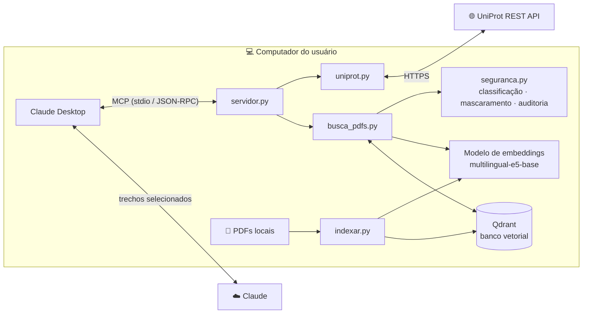

# MCP Research Agent

Servidor [MCP](https://modelcontextprotocol.io) (Model Context Protocol) que dá ao **Claude Desktop** duas capacidades de pesquisa científica:

- 🧬 **Proteínas e peptídeos**: consulta o [UniProt](https://www.uniprot.org) por nome, gene, ID ou sequência de aminoácidos e retorna função, localização celular e estruturas (PDB/AlphaFold).
- 📚 **Biblioteca pessoal de PDFs**: busca semântica (RAG) nos PDFs do seu computador, **em português e inglês**, inclusive PDFs escaneados (OCR), com citação de arquivo e página.

Tudo roda localmente no Windows: os PDFs, o índice vetorial e o modelo de embeddings nunca saem da máquina. Só os trechos relevantes de cada busca vão para o Claude, e passam por uma camada de segurança antes disso.

```
Você:   O que meus artigos dizem sobre como peptídeos antimicrobianos matam bactérias?
Claude: [usa buscar_pdfs] Segundo review_amp.pdf (p. 4), eles se ligam por interação
        eletrostática aos fosfolipídios negativos da membrana e formam poros...
```

---

## Sumário

- [Funcionalidades](#funcionalidades)
- [Arquitetura](#arquitetura)
- [Como funciona o RAG](#como-funciona-o-rag)
- [Segurança e privacidade](#segurança-e-privacidade)
- [Decisões técnicas e trade-offs](#decisões-técnicas-e-trade-offs)
- [Instalação](#instalação)
- [Uso](#uso)
- [Configuração](#configuração)
- [Estrutura do projeto](#estrutura-do-projeto)
- [Limitações e próximos passos](#limitações-e-próximos-passos)
- [Problemas comuns](#problemas-comuns)

---

## Funcionalidades

### Ferramentas MCP

| Ferramenta | O que faz |
|---|---|
| `buscar_proteina` | Busca no UniProt. Um **roteador** detecta o tipo da entrada: nome/gene/ID → busca textual priorizando entradas revisadas (Swiss-Prot); sequência → Peptide Search (correspondência exata); DNA/RNA → recusa com explicação. |
| `buscar_pdfs` | Busca semântica nos PDFs locais. Encontra trechos pelo **significado**, não por palavra exata, e funciona entre idiomas (pergunta em PT encontra texto em EN). Filtro opcional por nome de arquivo. |
| `listar_pdfs` | Lista os PDFs indexados (nomes e nº de trechos), ocultando os confidenciais. |

### Destaques

- **Indexação incremental**: cada PDF é identificado pelo hash SHA-256 do conteúdo. Rodar de novo só processa arquivos novos ou alterados, remove do índice os apagados e indexa duplicatas uma vez só.
- **OCR automático**: páginas sem texto (escaneadas) são lidas com EasyOCR. Os trechos vindos de OCR são marcados para o Claude saber que podem ter erros.
- **Resiliência**: novas tentativas com *backoff* em falhas temporárias das APIs públicas, timeouts em todas as chamadas e mensagens de erro legíveis para o modelo.
- **Instalador de um clique**: `instalar.bat` configura tudo, sem exigir Docker (o banco roda como processo *sidecar*).

---

## Arquitetura



- O **Claude Desktop** inicia o `servidor.py` como subprocesso e troca mensagens JSON-RPC pela entrada/saída padrão (*stdio*).
- A **lógica de negócio** (`uniprot.py`, `busca_pdfs.py`) é separada do MCP (`servidor.py`). Dá para testar cada módulo sozinho e reaproveitá-los numa futura interface própria.
- O **indexador** é um script separado, rodado quando há PDFs novos.

---

## Como funciona o RAG

**RAG** (*Retrieval-Augmented Generation*) = buscar trechos relevantes e entregá-los ao modelo para ele gerar a resposta com base neles.

```mermaid
flowchart TB
    subgraph IDX["Indexação (indexar.py)"]
        direction LR
        A["PDF"] -->|PyMuPDF / OCR| B["Texto por página"]
        B -->|"RecursiveCharacterTextSplitter<br/>1000 chars, overlap 200"| C["Chunks"]
        C -->|"e5 · prefixo 'passage: '"| D["Vetores 768-d"]
        D --> DB[("Qdrant<br/>vetor + texto + metadados")]
    end
    subgraph BUSCA["Busca (buscar_pdfs)"]
        direction LR
        Q["Pergunta"] -->|"e5 · prefixo 'query: '"| V["Vetor"]
        V -->|"similaridade de cosseno"| DB2[("Qdrant")]
        DB2 --> K["k trechos mais próximos"]
        K -->|"filtros de segurança"| R["Resposta ao Claude"]
    end
```



1. **Extração**: PyMuPDF lê o texto de cada página. Páginas com menos de 20 caracteres vão para o OCR.
2. **Chunking**: o texto é dividido em pedaços de ~1000 caracteres com 200 de sobreposição, quebrando preferencialmente em parágrafos e frases.
3. **Embeddings**: cada chunk vira um vetor de 768 dimensões. Textos com significado parecido geram vetores próximos, mesmo em idiomas diferentes.
4. **Armazenamento**: vetor + texto + metadados (arquivo, página, hash) vão para o Qdrant, com IDs determinísticos (reexecuções sobrescrevem em vez de duplicar).
5. **Busca**: a pergunta vira vetor, e o Qdrant devolve os *k* chunks mais próximos pelo cosseno, já filtrados pela política de segurança.

---

## Segurança e privacidade

A indexação é 100% local, mas os **trechos retornados pela busca são enviados ao Claude**. Por isso existe uma camada de *Data Loss Prevention* com defesa em profundidade:

| Camada | Implementação |
|---|---|
| **Allowlist** | Só as pastas listadas no config são lidas. Termos como "boleto", "extrato" e "contrato" no caminho excluem o arquivo. |
| **Minimização** | No máximo 15 trechos por busca, cada um limitado a 1200 caracteres. |
| **Classificação** | Cada PDF recebe um nível (`publico` < `interno` < `confidencial`) pelo caminho. Acima do nível permitido, ele não é retornado, **nem o nome do arquivo**. O filtro roda dentro do Qdrant, antes da seleção dos resultados. A política é aplicada na hora da busca, então mudá-la não exige reindexar. |
| **Mascaramento** | CPF, CNPJ, e-mail, telefone e cartão viram `[CPF]`, `[EMAIL]` etc. CPF e cartão são **validados pelo dígito verificador** (módulo 11 / Luhn) para evitar falsos positivos em números científicos. |
| **Auditoria** | Cada chamada é registrada em `logs/auditoria.jsonl`: argumentos, fontes, trechos mascarados e **hash SHA-256** do que saiu. O texto em si não é salvo por padrão, para o log não virar outra cópia dos dados. |
| **Consentimento** | Aviso de privacidade com aceite explícito (padrão = "Não") antes da primeira indexação. |

Outras medidas: o banco escuta só em `127.0.0.1` (inacessível pela rede), a telemetria do Qdrant e do Hugging Face fica desligada, o servidor roda o modelo em modo offline, e o instalador confere o hash oficial do executável baixado.

---

## Decisões técnicas e trade-offs

| Decisão | Alternativas consideradas | Por quê |
|---|---|---|
| **SDK oficial `mcp`** (`MCPServer`) | `fastmcp` standalone, SDK de baixo nível | Referência mantida junto com a especificação; menos dependências. |
| **httpx** (assíncrono) | requests, aiohttp | Uma chamada lenta não trava o servidor; já é dependência do SDK. |
| **Qdrant** | ChromaDB, FAISS, LanceDB, pgvector | Robusto, com filtros por metadados e índices de payload. O mesmo código funciona via Docker ou como executável local. |
| **Qdrant como processo *sidecar*** | Docker obrigatório, modo embutido | Docker é pesado para usuário final. O modo embutido permite só um processo por vez (indexador × servidor). O sidecar é o padrão de apps desktop como Ollama e language servers. |
| **`intfloat/multilingual-e5-base`** | MiniLM (só inglês), bge-m3 (mais pesado), APIs pagas | PT + EN no mesmo espaço vetorial, roda em CPU. APIs de embedding enviariam o conteúdo dos PDFs para fora. |
| **PyMuPDF** direto | `langchain-community` loaders, pypdf | Rápido e bom com duas colunas. O `langchain-community` está sendo descontinuado. |
| **EasyOCR** | Tesseract, docling | Só `pip install`, sem instalador externo para o usuário final. Reaproveita o PyTorch já instalado. |
| **Peptide Search** para sequências | BLAST | Rápido e exato para peptídeos. O BLAST (similaridade) é assíncrono e lento, então ficou como próximo passo. |

<details>
<summary><b>Detalhes que valem uma nota</b></summary>

- **`127.0.0.1` em vez de `localhost`**: no Windows, `localhost` tenta IPv6 primeiro, e cada conexão perdia ~2,5 s até cair no IPv4. A troca reduziu a busca de 5,8 s para 0,7 s.
- **Modelo carregado sob demanda**: o servidor sobe em segundos (o Claude Desktop derruba servidores lentos); só a primeira busca paga o carregamento.
- **Buscas pesadas em thread** (`asyncio.to_thread`): rodar o modelo usa CPU, então a busca não bloqueia o servidor.
- **Nunca `print()` no servidor**: o stdout é o canal do protocolo MCP. Logs vão para o stderr.
- **Instruções diretivas no servidor**: sem elas, o Claude responde de memória sobre temas conhecidos (ex.: p53) e não consulta as ferramentas.

</details>

---

## Instalação

### Requisitos (Windows)

1. [Python 3.12+](https://www.python.org/downloads/) (marque **"Add python.exe to PATH"**)
2. [Claude Desktop](https://claude.ai/download)

Docker **não** é necessário.

### Passos

1. Clone ou baixe este repositório para um lugar fixo (ex.: `C:\Projetos\mcp-research-agent`). **Não mova depois**: o Claude Desktop guarda o caminho.
2. Dê **duplo clique em `instalar.bat`**. A primeira vez leva ~10 minutos (~1,5 GB entre bibliotecas e modelo).
3. Reinicie o Claude Desktop pelo **ícone da bandeja** (perto do relógio) → Sair, e abra de novo.

O instalador é idempotente (pode ser rodado de novo) e executa:

```
1/6 Procura Python 3.12+
2/6 Cria o ambiente virtual e instala as dependências
3/6 Gera o config.toml com as pastas reais do usuário (inclusive OneDrive)
4/6 Baixa o Qdrant, confere o hash SHA-256 e o inicia
5/6 Baixa o modelo de embeddings
6/6 Registra o servidor no Claude Desktop (com backup do JSON)
```

<details>
<summary><b>Instalação manual / modo Docker</b></summary>

```bash
python -m venv .venv
.venv\Scripts\activate
pip install -r requirements.txt
copy config.exemplo.toml config.toml    # edite as pastas e use modo = "docker"
docker compose up -d
python indexar.py
python registrar_claude.py
```

</details>

---

## Uso

Converse normalmente no Claude Desktop. O servidor instrui o Claude a usar as ferramentas sozinho:

- *"O que é a TP53?"*
- *"O que meus PDFs dizem sobre peptídeos antimicrobianos?"*
- *"Quais PDFs eu tenho indexados?"*
- *"De qual proteína é o peptídeo GIVEQCCTSICSLYQLENYCN?"*

**Adicionou ou alterou PDFs?** Reindexe (só processa o que mudou):

```bash
.venv\Scripts\python.exe indexar.py
```

Use `--reindexar` para reprocessar tudo (ex.: depois de ligar o OCR).

### Testando sem o Claude

Cada módulo roda sozinho:

```bash
python uniprot.py TP53
python busca_pdfs.py "mecanismo de ação de peptídeos"
```

E o servidor pode ser inspecionado com o [MCP Inspector](https://github.com/modelcontextprotocol/inspector):

```bash
npx @modelcontextprotocol/inspector .venv\Scripts\python.exe servidor.py
```

---

## Configuração

Tudo em `config.toml` (gerado a partir de `config.exemplo.toml`):

| Seção | O que ajustar |
|---|---|
| `[indexacao]` | pastas indexadas (allowlist) e termos de exclusão |
| `[chunking]` | tamanho e sobreposição dos trechos |
| `[embeddings]` | modelo de embeddings |
| `[qdrant]` | `modo = "executavel"` (padrão) ou `"docker"` |
| `[seguranca]` | níveis de classificação, mascaramento, auditoria |
| `[ocr]` | liga/desliga, idiomas, resolução (DPI) |

Mudou `[seguranca]`? Reinicie o Claude Desktop. Mudou pastas ou chunking? Rode o `indexar.py`.

---

## Estrutura do projeto

| Arquivo | Papel |
|---|---|
| `servidor.py` | Servidor MCP: registra as ferramentas e faz a auditoria |
| `uniprot.py` | Cliente do UniProt: roteador de entrada, busca textual, Peptide Search |
| `busca_pdfs.py` | Busca semântica no Qdrant, com filtros de segurança |
| `indexar.py` | Pipeline de indexação: PDF → texto/OCR → chunks → embeddings → Qdrant |
| `rag.py` | Config, modelo de embeddings e ciclo de vida do Qdrant (sidecar) |
| `seguranca.py` | Classificação, mascaramento de dados pessoais e auditoria |
| `registrar_claude.py` | Registra/remove o servidor no config do Claude Desktop |
| `instalar.ps1` / `.bat` | Instalador |
| `docker-compose.yml` | Alternativa: Qdrant via Docker |
| `ESTUDO.md` | Roteiro de estudo com exercícios sobre os conceitos do projeto |

---

## Limitações e próximos passos

**Limitações conhecidas**

- Só Windows (instalador, caminhos e Qdrant sidecar).
- A busca por sequência é **exata**: sequências parecidas, mas não idênticas, não são encontradas.
- OCR na CPU é lento (~1 min por página densa); com GPU NVIDIA + PyTorch CUDA fica bem mais rápido (detectado automaticamente).
- O Claude decide quando usar as ferramentas: as instruções aumentam muito a chance, mas não garantem 100%.
- A primeira busca de cada sessão leva ~30 s (carrega o modelo e inicia o banco).

**Roadmap**

- [ ] BLAST para busca por similaridade de sequência
- [ ] Ferramenta de fármacos e pequenas moléculas (PubChem / ChEBI)
- [ ] Interface própria (ex.: Streamlit + API do Claude), com busca garantida antes da resposta
- [ ] Suporte a macOS/Linux
- [ ] Busca híbrida (vetorial + palavra-chave) e *reranking*

---

## Problemas comuns

| Sintoma | Solução |
|---|---|
| Busca nos PDFs dá erro de conexão | Veja `logs\qdrant.log`; rode o `instalar.bat` de novo |
| 1ª busca demora ~30 s | Normal: carrega o modelo e inicia o banco. As seguintes levam ~1 s |
| Indexação parece travada | PDFs escaneados passam por OCR (~1 min/página na CPU); o log mostra a página atual |
| Ferramentas não aparecem no Claude | Reinicie o Claude pela bandeja; confira em Configurações → Desenvolvedor |
| "O índice ainda não existe" | Rode `indexar.py` |
| Aviso "página(s) sem texto nem com OCR" | Normal para páginas só com figuras ou em branco |

**Desinstalar do Claude Desktop:** `.venv\Scripts\python.exe registrar_claude.py --remover`
