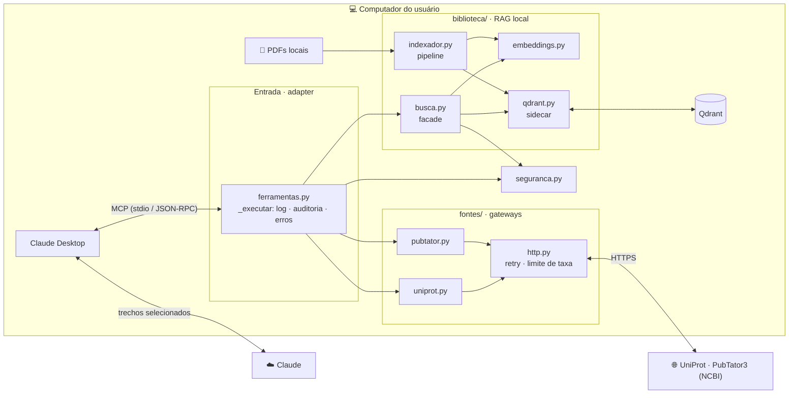
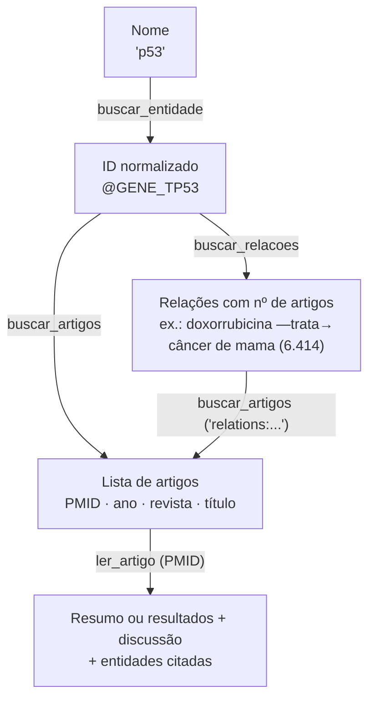

# MCP Research Agent

Servidor [MCP](https://modelcontextprotocol.io) (Model Context Protocol) que dá ao **Claude Desktop** três capacidades de pesquisa científica:

- 🧬 **Proteínas e peptídeos**: consulta o [UniProt](https://www.uniprot.org) por nome, gene, ID ou sequência de aminoácidos e retorna função, localização celular e estruturas (PDB/AlphaFold).
- 📰 **Literatura científica**: busca e lê artigos do PubMed pelo [PubTator3](https://www.ncbi.nlm.nih.gov/research/pubtator3/) (NCBI/NIH), com genes, doenças e químicos já anotados, e consulta relações extraídas de toda a literatura (ex.: que doenças um fármaco trata), citando PMIDs.
- 📚 **Biblioteca pessoal de PDFs**: busca semântica (RAG) nos PDFs do seu computador, **em português e inglês**, inclusive PDFs escaneados (OCR), com citação de arquivo e página.

Roda no Windows. Os PDFs, o índice vetorial e o modelo de embeddings nunca saem da máquina: só os trechos relevantes de cada busca vão para o Claude, e passam por uma camada de segurança antes disso. As consultas de proteínas e de literatura vão para as APIs públicas do UniProt e do NCBI, levando apenas o termo pesquisado.

```
Você:   O que meus artigos dizem sobre como peptídeos antimicrobianos matam bactérias?
Claude: [usa buscar_pdfs] Segundo review_amp.pdf (p. 4), eles se ligam por interação
        eletrostática aos fosfolipídios negativos da membrana e formam poros...

Você:   Quais doenças a doxorrubicina trata, segundo a literatura?
Claude: [usa buscar_entidade e buscar_relacoes] A relação mais sustentada é com
        neoplasias em geral (~14.900 artigos), seguida de câncer de mama (~6.400),
        carcinoma hepatocelular (~1.650) e osteossarcoma (~1.130)...
```

---

## Sumário

- [Funcionalidades](#funcionalidades)
- [Arquitetura](#arquitetura)
- [Padrões de projeto](#padrões-de-projeto)
- [Como funciona o RAG](#como-funciona-o-rag)
- [Como funciona a busca na literatura](#como-funciona-a-busca-na-literatura)
- [Segurança e privacidade](#segurança-e-privacidade)
- [Decisões técnicas e trade-offs](#decisões-técnicas-e-trade-offs)
- [Instalação](#instalação)
- [Uso](#uso)
- [Configuração](#configuração)
- [Estrutura do projeto](#estrutura-do-projeto)
- [Limitações e próximos passos](#limitações-e-próximos-passos)
- [Problemas comuns](#problemas-comuns)

---

## Funcionalidades

### Ferramentas MCP

| Ferramenta | O que faz |
|---|---|
| `buscar_proteina` | Busca no UniProt. Um **roteador** detecta o tipo da entrada: nome/gene/ID → busca textual priorizando entradas revisadas (Swiss-Prot); sequência → Peptide Search (correspondência exata); DNA/RNA → recusa com explicação. |
| `buscar_pdfs` | Busca semântica nos PDFs locais. Encontra trechos pelo **significado**, não por palavra exata, e funciona entre idiomas (pergunta em PT encontra texto em EN). Filtro opcional por nome de arquivo. |
| `listar_pdfs` | Lista os PDFs indexados (nomes e nº de trechos), ocultando os confidenciais. |
| `buscar_entidade` | Converte um nome ("p53", "doxorubicin") no ID normalizado do PubTator (`@GENE_TP53`), que encontra todos os sinônimos. Mostra os candidatos para o Claude conferir a ambiguidade. |
| `buscar_artigos` | Busca no PubMed por texto livre, IDs de entidade (combináveis com AND/OR) ou relações. Retorna PMID, ano, revista e título, 10 por página. |
| `ler_artigo` | Lê um artigo pelo PMID: resumo ou, para artigos do PMC Open Access, resultados e discussão. Termina com um resumo das entidades anotadas e avisa quando o texto completo não existe. |
| `buscar_relacoes` | Relações entre entidades extraídas da literatura (trata, causa, associa, correlaciona…), com o nº de artigos que sustenta cada uma. Base para levantar hipóteses como reposicionamento de fármacos. |

### Destaques

- **Indexação incremental**: cada PDF é identificado pelo hash SHA-256 do conteúdo. Rodar de novo só processa arquivos novos ou alterados, remove do índice os apagados e indexa duplicatas uma vez só.
- **OCR automático**: páginas sem texto (escaneadas) são lidas com EasyOCR. Os trechos vindos de OCR são marcados para o Claude saber que podem ter erros.
- **Economia de contexto**: a busca de artigos e a leitura são ferramentas separadas (o Claude vê os títulos e só abre o que interessa), e a leitura descarta métodos, tabelas e referências, o que reduz um artigo completo típico em ~58%.
- **Limite de taxa**: as chamadas ao PubTator são espaçadas para respeitar o limite de 3 requisições/s do NCBI, inclusive quando o Claude chama várias ferramentas em paralelo.
- **Resiliência**: novas tentativas com *backoff* em falhas temporárias das APIs públicas, timeouts em todas as chamadas e mensagens de erro legíveis para o modelo.
- **Instalador de um clique**: `instalar.bat` configura tudo, sem Docker (o banco roda como processo *sidecar*).

---

## Arquitetura

O código é organizado em **camadas**: cada uma só conhece a de baixo.



| Camada | Pasta | Responsabilidade | Conhece o MCP? |
|---|---|---|---|
| **Entrada** | `ferramentas.py` | Declara as ferramentas para o Claude e passa toda chamada por um caminho único | Sim (só ela) |
| **Fontes** | `fontes/` | Um cliente por API externa: HTTP, JSON, retry e formatação do texto | Não |
| **Biblioteca** | `biblioteca/` | RAG local: indexação, modelo de embeddings, banco vetorial e busca | Não |
| **Transversal** | `seguranca.py`, `config.py`, `contrato.py` | Políticas e definições usadas por todas as camadas | Não |

Como só a camada de entrada conhece o MCP, as fontes podem ser testadas sozinhas e reaproveitadas numa futura interface própria (web, CLI) sem mudança.

---

## Padrões de projeto

| Padrão | Onde | Para quê |
|---|---|---|
| **Adapter** | `ferramentas.py` | Traduz o protocolo MCP em chamadas de funções Python comuns |
| **Contrato** | `contrato.py` | Toda fonte devolve `Resultado` ou levanta `ErroEsperado`: a entrada trata todas igual |
| **Gateway** | `fontes/uniprot.py`, `fontes/pubtator.py` | Um módulo por serviço externo esconde URLs, JSON e erros da API |
| **Retry com backoff** + **limite de taxa** | `fontes/http.py` | Falhas temporárias (timeout, 429, 5xx) são repetidas com espera crescente; o NCBI exige ≤ 3 req/s |
| **Strategy** (roteador) | `uniprot.detectar_tipo` | Escolhe o algoritmo de busca (nome × sequência) conforme a entrada |
| **Facade** | `biblioteca/busca.py` | Uma função simples esconde Qdrant, embeddings e filtros de segurança |
| **Pipeline** | `biblioteca/indexador.py` | Extrair → dividir → vetorizar → gravar, em etapas independentes |
| **Sidecar** | `biblioteca/qdrant.py` | O banco vetorial roda como processo auxiliar, ligado sob demanda |
| **Lazy loading** + **memoização** | `embeddings.py`, `busca._recursos` | Bibliotecas e modelo pesados só carregam quando usados, e uma vez só |

### O caminho de uma chamada

Toda ferramenta segue o mesmo fluxo, definido uma vez em `_executar`:

```
Claude ──► ferramenta (valida limites)
               │
               ▼
           _executar ──► fonte.operacao(...) ──► Resultado(texto, auditoria)
               │                                   │
               │   ErroEsperado? ──► ToolError (mensagem legível para o Claude)
               ▼
           seguranca.registrar(...)  ──►  logs/auditoria.jsonl
               │
               ▼
Claude ◄── resultado.texto
```

Para criar uma ferramenta nova: (1) escreva a operação numa fonte, devolvendo `Resultado`; (2) declare a ferramenta em `ferramentas.py` chamando `_executar`. Log, auditoria e tratamento de erro vêm de graça.

---

## Como funciona o RAG

**RAG** (*Retrieval-Augmented Generation*) = buscar trechos relevantes e entregá-los ao modelo para ele gerar a resposta com base neles.

```mermaid
flowchart TB
    subgraph IDX["Indexação (indexar.py)"]
        direction LR
        A["PDF"] -->|PyMuPDF / OCR| B["Texto por página"]
        B -->|"RecursiveCharacterTextSplitter<br/>1000 chars, overlap 200"| C["Chunks"]
        C -->|"e5 · prefixo 'passage: '"| D["Vetores 768-d"]
        D --> DB[("Qdrant<br/>vetor + texto + metadados")]
    end
    subgraph BUSCA["Busca (buscar_pdfs)"]
        direction LR
        Q["Pergunta"] -->|"e5 · prefixo 'query: '"| V["Vetor"]
        V -->|"similaridade de cosseno"| DB2[("Qdrant")]
        DB2 --> K["k trechos mais próximos"]
        K -->|"filtros de segurança"| R["Resposta ao Claude"]
    end
```



1. **Extração**: PyMuPDF lê o texto de cada página. Páginas com menos de 20 caracteres vão para o OCR.
2. **Chunking**: o texto é dividido em pedaços de ~1000 caracteres com 200 de sobreposição, quebrando preferencialmente em parágrafos e frases.
3. **Embeddings**: cada chunk vira um vetor de 768 dimensões. Textos com significado parecido geram vetores próximos, mesmo em idiomas diferentes.
4. **Armazenamento**: vetor + texto + metadados (arquivo, página, hash) vão para o Qdrant, com IDs determinísticos (reexecuções sobrescrevem em vez de duplicar).
5. **Busca**: a pergunta vira vetor, e o Qdrant devolve os *k* chunks mais próximos pelo cosseno, já filtrados pela política de segurança.

---

## Como funciona a busca na literatura

O [PubTator3](https://www.ncbi.nlm.nih.gov/research/pubtator3/) é um serviço do NCBI que passou modelos de IA por todo o PubMed e marcou, em cada artigo, os genes, doenças, químicos, variantes e espécies citados, já normalizados ("Dox", "doxorubicin" e "Doxorubicin" viram a mesma entidade). A partir dessas marcações, ele também extraiu relações ("X trata Y", "X inibe Y") e contou em quantos artigos cada uma aparece.



1. **Entidade**: o nome vira um ID. Buscar pelo ID encontra todos os sinônimos. Como o autocomplete casa por prefixo, a ferramenta mostra os candidatos e o Claude escolhe o certo pelo contexto da conversa.
2. **Busca**: devolve só a "ficha" dos artigos, 10 por página, para o Claude escolher o que vale abrir.
3. **Leitura**: título e resumo por padrão. Com `texto_completo`, inclui resultados e discussão (só para artigos do PMC Open Access) e descarta métodos, tabelas e referências. Termina com as entidades mais citadas, que mostram de relance, por exemplo, se o estudo foi feito em humanos ou em camundongos.
4. **Relações**: o grafo de toda a literatura, ordenado pelo número de artigos. É a base para levantar hipóteses, como achar fármacos já existentes associados a um gene (reposicionamento).

---

## Segurança e privacidade

A indexação é 100% local, mas os **trechos retornados pela busca são enviados ao Claude**. Por isso existe uma camada de *Data Loss Prevention* com defesa em profundidade:

| Camada | Implementação |
|---|---|
| **Allowlist** | Só as pastas listadas no config são lidas. Termos como "boleto", "extrato" e "contrato" no caminho excluem o arquivo. |
| **Minimização** | No máximo 15 trechos por busca, cada um limitado a 1200 caracteres. |
| **Classificação** | Cada PDF recebe um nível (`publico` < `interno` < `confidencial`) pelo caminho. Acima do nível permitido, ele não é retornado, **nem o nome do arquivo**. O filtro roda dentro do Qdrant, antes da seleção dos resultados. A política é aplicada na hora da busca, então mudá-la não exige reindexar. |
| **Mascaramento** | CPF, CNPJ, e-mail, telefone e cartão viram `[CPF]`, `[EMAIL]` etc. CPF e cartão são **validados pelo dígito verificador** (módulo 11 / Luhn) para evitar falsos positivos em números científicos. |
| **Auditoria** | Cada chamada é registrada em `logs/auditoria.jsonl`: argumentos, fontes, trechos mascarados e **hash SHA-256** do que saiu. O texto em si não é salvo por padrão, para o log não virar outra cópia dos dados. |
| **Consentimento** | Aviso de privacidade com aceite explícito (padrão = "Não") antes da primeira indexação. |

Outras medidas: o banco escuta só em `127.0.0.1` (inacessível pela rede), a telemetria do Qdrant e do Hugging Face fica desligada, o servidor roda o modelo em modo offline, o instalador confere o hash oficial do executável baixado e todas as ferramentas são declaradas como somente leitura (`readOnlyHint`): nenhuma cria, altera ou apaga nada.

---

## Decisões técnicas e trade-offs

| Decisão | Alternativas consideradas | Por quê |
|---|---|---|
| **SDK oficial `mcp`** (`MCPServer`) | `fastmcp` standalone, SDK de baixo nível | Referência mantida junto com a especificação; menos dependências. |
| **httpx** (assíncrono) | requests, aiohttp | Uma chamada lenta não trava o servidor; já é dependência do SDK. |
| **Qdrant** | ChromaDB, FAISS, LanceDB, pgvector | Robusto, com filtros por metadados e índices de payload, e distribuído como um executável único para Windows. |
| **Qdrant como processo *sidecar*** | Docker, modo embutido | Docker é pesado para usuário final e complicava os releases (havia dois modos para manter e testar), então foi removido. O modo embutido permite só um processo por vez (indexador × servidor). O sidecar é o padrão de apps desktop como Ollama e language servers. |
| **`intfloat/multilingual-e5-base`** | MiniLM (só inglês), bge-m3 (mais pesado), APIs pagas | PT + EN no mesmo espaço vetorial, roda em CPU. APIs de embedding enviariam o conteúdo dos PDFs para fora. |
| **PyMuPDF** direto | `langchain-community` loaders, pypdf | Rápido e bom com duas colunas. O `langchain-community` está sendo descontinuado. |
| **EasyOCR** | Tesseract, docling | Só `pip install`, sem instalador externo para o usuário final. Reaproveita o PyTorch já instalado. |
| **Peptide Search** para sequências | BLAST | Rápido e exato para peptídeos. O BLAST (similaridade) é assíncrono e lento, então ficou como próximo passo. |
| **PubTator3** para literatura | E-utilities do PubMed, Europe PMC | Além de buscar, entrega as entidades já anotadas e normalizadas ("Dox" = "doxorubicin") e um grafo de relações extraído de toda a literatura. |
| **Buscar e ler em ferramentas separadas** | Uma ferramenta que já devolve os textos | Um artigo completo tem dezenas de milhares de caracteres. Separar deixa o Claude escolher o que ler, como o RAG faz com os trechos. |
| **Resolver a entidade numa ferramenta à parte** | Converter o nome em ID automaticamente | O autocomplete casa por prefixo: "aging" vira "Aging Premature", e "CAT" pode ser gene ou catarata. Mostrando os candidatos, quem decide é o Claude, que tem o contexto da conversa. |
| **Filtrar seções do artigo** | Enviar o texto inteiro | Resultados e discussão respondem "o que o artigo descobriu"; tabelas viram texto ilegível e referências não têm conteúdo. Em revisões (sem resultados/discussão), o corpo é mantido. Teto de 20 mil caracteres, com aviso quando corta. |

<details>
<summary><b>Detalhes que valem uma nota</b></summary>

- **`127.0.0.1` em vez de `localhost`**: no Windows, `localhost` tenta IPv6 primeiro, e cada conexão perdia ~2,5 s até cair no IPv4. A troca reduziu a busca de 5,8 s para 0,7 s.
- **Inicialização rápida + pré-carregamento**: bibliotecas pesadas são importadas sob demanda, então o servidor responde ao Claude em ~2 s (servidores lentos são derrubados por timeout). Em seguida, uma thread em segundo plano carrega o modelo, e a primeira busca não espera.
- **Buscas pesadas em thread** (`asyncio.to_thread`): rodar o modelo usa CPU, então a busca não bloqueia o servidor.
- **Nunca `print()` no servidor**: o stdout é o canal do protocolo MCP. Logs vão para o stderr.
- **Instruções diretivas no servidor**: sem elas, o Claude responde de memória sobre temas conhecidos (ex.: p53) e não consulta as ferramentas.

</details>

---

## Instalação

### Requisitos (Windows)

1. [Python 3.12+](https://www.python.org/downloads/) (marque **"Add python.exe to PATH"**)
2. [Claude Desktop](https://claude.ai/download)

Docker **não** é necessário.

### Download

⬇️ **[Baixar a versão mais recente](https://github.com/GuilhermeFusari/mcp-research-agent/releases/latest)**: em *Assets*, clique em **Source code (zip)**.

### Passos

1. Extraia o zip num lugar fixo (ex.: `C:\Projetos\mcp-research-agent`). **Não mova depois**: o Claude Desktop guarda o caminho.
2. Dê **duplo clique em `instalar.bat`**. Se o Windows mostrar *"O Windows protegeu o computador"* (acontece com qualquer script baixado da internet), clique em **Mais informações → Executar assim mesmo**. A primeira vez leva ~10 minutos (~1,5 GB entre bibliotecas e modelo).
3. Reinicie o Claude Desktop pelo **ícone da bandeja** (perto do relógio) → Sair, e abra de novo.

O instalador é idempotente (pode ser rodado de novo) e executa:

```
1/6 Procura Python 3.12+
2/6 Cria o ambiente virtual e instala as dependências
3/6 Gera o config.toml com as pastas reais do usuário (inclusive OneDrive)
4/6 Baixa o Qdrant, confere o hash SHA-256 e o inicia
5/6 Baixa o modelo de embeddings
6/6 Registra o servidor no Claude Desktop (com backup do JSON)
```

<details>
<summary><b>Instalação manual</b></summary>

```bash
python -m venv .venv
.venv\Scripts\activate
pip install -r requirements.txt
copy config.exemplo.toml config.toml    # edite as pastas
python indexar.py
python registrar_claude.py
```

Antes do `indexar.py`, baixe o [Qdrant v1.19.1 para Windows](https://github.com/qdrant/qdrant/releases/tag/v1.19.1) (`qdrant-x86_64-pc-windows-msvc.zip`) e extraia o `qdrant.exe` em `bin\`. O programa o inicia sozinho.

</details>

### Atualizando de uma versão anterior

1. Baixe a versão nova e copie os arquivos para a pasta atual, substituindo os antigos. O `config.toml`, os dados (`qdrant_data\`) e o índice dos PDFs são preservados.
2. Rode o `instalar.bat` de novo. Ele só instala o que mudou.
3. Reinicie o Claude Desktop pela bandeja → Sair.

Vindo de uma versão com `modo = "docker"` no `config.toml`: essa opção foi removida na v1.1.0. O instalador baixa o `qdrant.exe`, que usa a mesma pasta de dados, então não é preciso reindexar. Depois disso, a linha `modo` pode ser apagada.

---

## Uso

Converse normalmente no Claude Desktop. O servidor instrui o Claude a usar as ferramentas sozinho:

- *"O que é a TP53?"*
- *"O que meus PDFs dizem sobre peptídeos antimicrobianos?"*
- *"Quais PDFs eu tenho indexados?"*
- *"De qual proteína é o peptídeo GIVEQCCTSICSLYQLENYCN?"*
- *"Que evidências recentes existem sobre TP53 em câncer de mama? Cite os artigos."*
- *"Quais doenças a doxorrubicina trata, segundo a literatura?"*
- *"Que químicos reduzem a atividade de TP53?"*

**Adicionou ou alterou PDFs?** Reindexe (só processa o que mudou):

```bash
.venv\Scripts\python.exe indexar.py
```

Use `--reindexar` para reprocessar tudo (ex.: depois de ligar o OCR).

### Testando sem o Claude

Cada fonte roda sozinha (a partir da raiz do projeto):

```bash
python -m agente_pesquisa.fontes.uniprot TP53
python -m agente_pesquisa.fontes.pubtator
python -m agente_pesquisa.biblioteca.busca "mecanismo de ação de peptídeos"
```

E o servidor pode ser inspecionado com o [MCP Inspector](https://github.com/modelcontextprotocol/inspector):

```bash
npx @modelcontextprotocol/inspector .venv\Scripts\python.exe servidor.py
```

---

## Configuração

Tudo em `config.toml` (gerado a partir de `config.exemplo.toml`):

| Seção | O que ajustar |
|---|---|
| `[indexacao]` | pastas indexadas (allowlist) e termos de exclusão |
| `[chunking]` | tamanho e sobreposição dos trechos |
| `[embeddings]` | modelo de embeddings |
| `[qdrant]` | porta (`url`) e nome da coleção |
| `[seguranca]` | níveis de classificação, mascaramento, auditoria |
| `[ocr]` | liga/desliga, idiomas, resolução (DPI) |

Mudou `[seguranca]`? Reinicie o Claude Desktop. Mudou pastas ou chunking? Rode o `indexar.py`.

---

## Estrutura do projeto

```
servidor.py               ponto de entrada do servidor MCP (o Claude Desktop executa este)
indexar.py                ponto de entrada do indexador de PDFs
registrar_claude.py       registra/remove o servidor no config do Claude Desktop
instalar.ps1 / .bat       instalador
config.exemplo.toml       modelo de configuração
agente_pesquisa/
├── ferramentas.py        ENTRADA: ferramentas MCP + _executar (log, auditoria, erros)
├── contrato.py           Resultado e ErroEsperado: o que toda fonte devolve
├── config.py             caminhos do projeto e leitura do config.toml
├── seguranca.py          classificação, mascaramento de dados pessoais e auditoria
├── fontes/               GATEWAYS: um cliente por API externa
│   ├── http.py           retry com backoff + limite de taxa (compartilhado)
│   ├── uniprot.py        roteador de entrada, busca textual, Peptide Search
│   └── pubtator.py       entidades, busca e leitura de artigos, relações
└── biblioteca/           RAG LOCAL
    ├── indexador.py      pipeline: PDF → texto/OCR → chunks → embeddings → Qdrant
    ├── busca.py          busca semântica com filtros de segurança
    ├── embeddings.py     modelo multilingual-e5
    └── qdrant.py         ciclo de vida do qdrant.exe (sidecar) e conexão
```

---

## Limitações e próximos passos

**Limitações conhecidas**

- Só Windows (instalador, caminhos e Qdrant sidecar).
- A busca por sequência é **exata**: sequências parecidas, mas não idênticas, não são encontradas.
- OCR na CPU é lento (~1 min por página densa); com GPU NVIDIA + PyTorch CUDA fica bem mais rápido (detectado automaticamente).
- As anotações e relações do PubTator são extraídas por IA e erram, principalmente com nomes curtos que também são palavras comuns (o gene CAT traz artigos sobre gatos). Os nºs de artigos ajudam a separar evidência de ruído.
- Texto completo de artigos só existe para o PMC Open Access; nos demais, só o resumo (a ferramenta avisa).
- O Claude decide quando usar as ferramentas: as instruções aumentam muito a chance, mas não garantem 100%.

**Roadmap**

- [ ] BLAST para busca por similaridade de sequência
- [ ] Cache local de artigos lidos (artigo publicado não muda)
- [ ] Ferramenta de fármacos e pequenas moléculas (PubChem / ChEBI)
- [ ] Interface própria (ex.: Streamlit + API do Claude), com busca garantida antes da resposta
- [ ] Suporte a macOS/Linux
- [ ] Busca híbrida (vetorial + palavra-chave) e *reranking*

---

## Problemas comuns

| Sintoma | Solução |
|---|---|
| Busca nos PDFs dá erro de conexão | Veja `logs\qdrant.log`; rode o `instalar.bat` de novo |
| 1ª busca demora | O modelo é pré-carregado em segundo plano logo que o Claude abre; perguntas feitas nos primeiros segundos podem esperar ele terminar |
| Indexação parece travada | PDFs escaneados passam por OCR (~1 min/página na CPU); o log mostra a página atual |
| Ferramentas não aparecem no Claude | Reinicie o Claude pela bandeja (fechar a janela não basta: o app e o servidor continuam rodando); confira em Configurações → Desenvolvedor |
| O Claude pede permissão a cada uso | É uma configuração do Claude Desktop: escolha **Permitir sempre** no pedido, ou ajuste as ferramentas do `agente-pesquisa` nas configurações de conectores |
| Responde sobre literatura sem citar PMIDs | Confira se o servidor foi reiniciado (as ferramentas de literatura existem a partir da v1.1.0); pedir "segundo a literatura" ou "cite os artigos" também ajuda |
| `bin\qdrant.exe não encontrado` | Rode o `instalar.bat` de novo (acontece ao atualizar de uma instalação que usava Docker) |
| Erro "PubTator não respondeu" | Instabilidade do NCBI; o servidor já tenta de novo sozinho, então espere alguns minutos |
| "O índice ainda não existe" | Rode `indexar.py` |
| Aviso "página(s) sem texto nem com OCR" | Normal para páginas só com figuras ou em branco |

**Desinstalar do Claude Desktop:** `.venv\Scripts\python.exe registrar_claude.py --remover`
